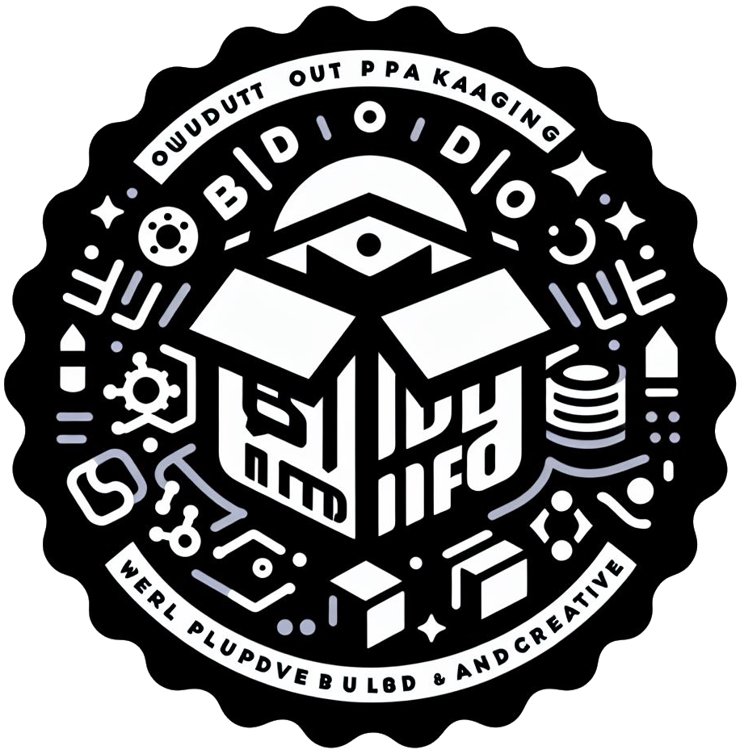

<p align="center"><a href="https://github.com/renzp94/vite-plugin-build-info" target="_blank" rel="noopener noreferrer"></a></p>
<p align="center">
  <a href="https://npmcharts.com/compare/@renzp/vite-plugin-build-info?minimal=true"></a>
  <a href="https://www.npmjs.com/package/@renzp/vite-plugin-build-info"></a>
  <a href="https://www.npmjs.com/package/@renzp/vite-plugin-build-info"></a>
</p>
<p align="center">
  <a href="https://github.com/renzp94/vite-plugin-build-info/watchers"></a>
  <a href="https://github.com/renzp94/vite-plugin-build-info/stars"></a>
</p>

# @renzp/vite-plugin-build-info

一款将打包信息打印在控制台的vite插件

- `Webpack插件`: [build-info-webpack-plugin](https://github.com/renzp94/build-info-webpack-plugin)
- `Vite插件`: [vite-plugin-build-info](https://github.com/renzp94/vite-plugin-build-info)

## Install

```sh
npm i @renzp/vite-plugin-build-info -D 
```

## Usage

`vite.config.ts`

```ts
import { defineConfig } from 'vite'
import ViteBuildInfoPlugin from '@renzp/vite-plugin-build-info'

export default defineConfig({
  plugins: [VitePlugin()],
})
```

如果使用的html模板名字不是`index.html`，则可通过`html`参数指定模板名称。注意是文件名称，不是文件路径。

例如：
  - html模板文件路径为：`./src/html/index.html`，则无需指定。
  - html模板文件路径为：`./src/html/app.html`，则需要指定`html: 'app.html'`

```ts
import { defineConfig } from 'vite'
import ViteBuildInfoPlugin from '@renzp/vite-plugin-build-info'

export default defineConfig({
  plugins: [VitePlugin({ html: 'app.html' })],
})
```

### Options

```ts
interface Options {
  // html模板文件，默认为index.html，如果使用的html模板不是index.html，则可以使用该选项指定模板文件名称
  html?: string
  // 是否显示项目名称(package.name)
  showName?:boolean
  // 是否显示项目版本号(package.version)
  showVersion?:boolean
  // 项目名称样式
  nameBlockColor?: string
  // 是否显示打包时间
  showTime?:boolean
  // 打包时间样式
  timeBlockColor?: string
  // 是否显示git信息
  showGit?:boolean
  // git信息样式
  gitBlockColor?: string
}
```